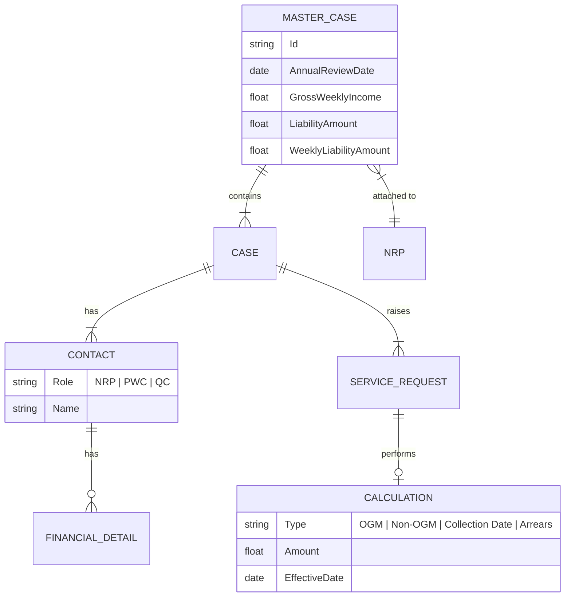
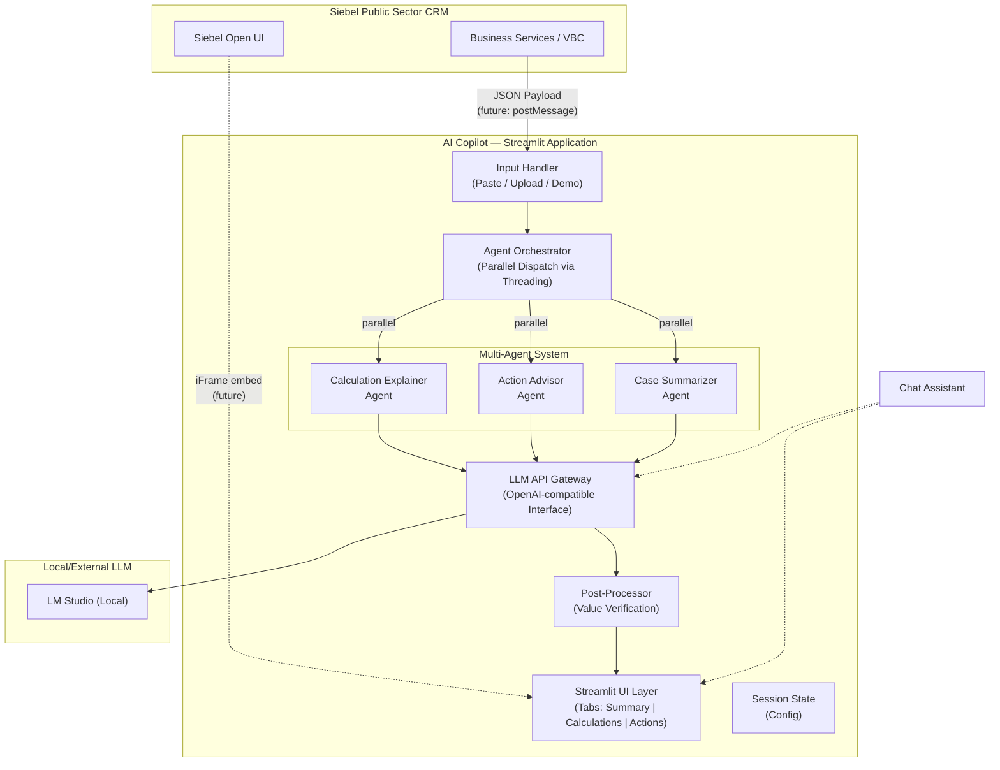
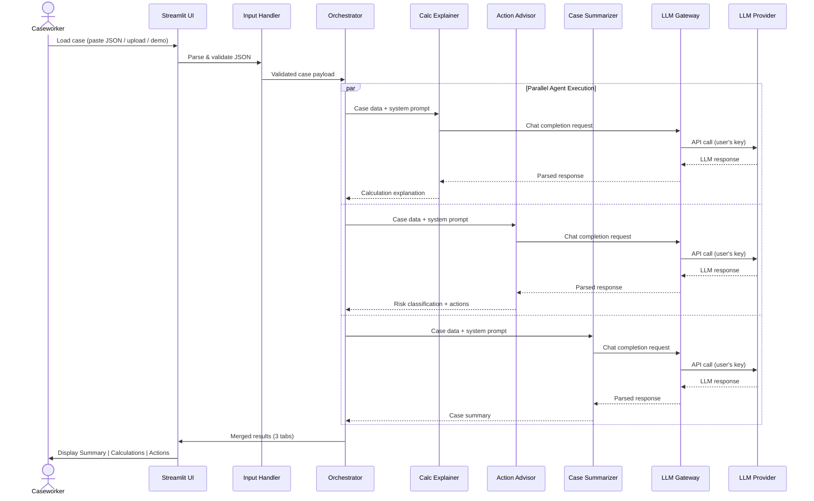
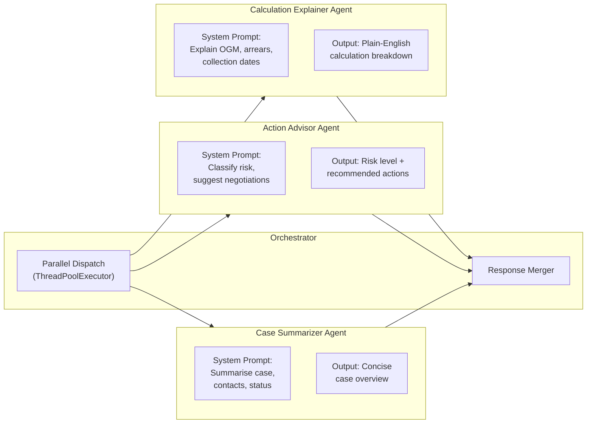
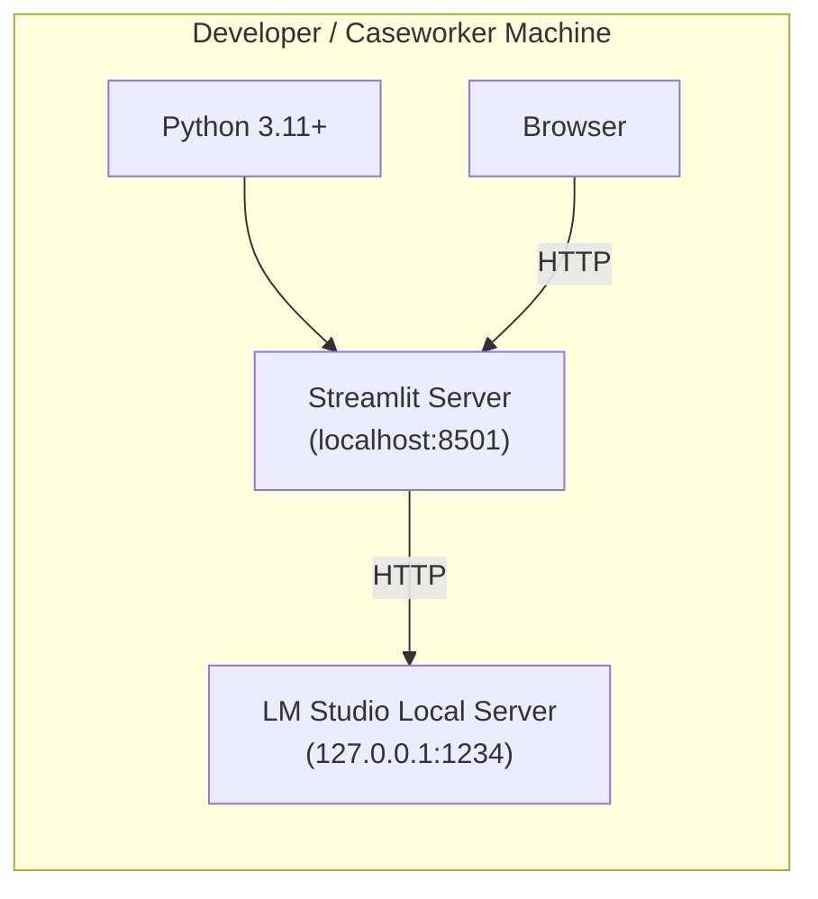
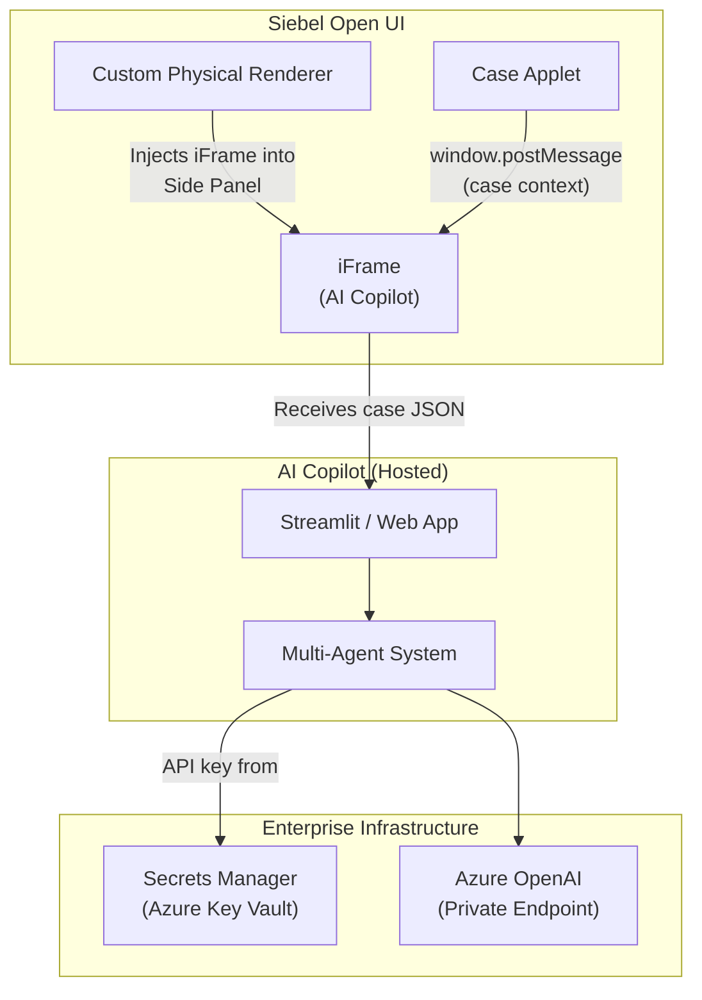

# High-Level Design (HLD) — AI Copilot for Caseworkers

| Field              | Detail                                              |
|--------------------|-----------------------------------------------------|
| **Project**        | AI Copilot for Caseworkers (Child Maintenance)       |
| **Version**        | 1.0 — Proof of Concept                              |
| **Date**           | 19 June 2026                                        |
| **Status**         | Draft                                                |
| **Domain**         | Public Sector — Child Maintenance Case Management    |
| **Integration**    | Siebel Public Sector CRM                             |

---

## 1. Introduction

### 1.1 Purpose

This document describes the high-level architecture of the **AI Copilot for Caseworkers** — a Proof-of-Concept application that assists Child Maintenance caseworkers by **explaining** complex financial calculations in plain English, classifying enforcement risk, and summarising case data. The system integrates with Oracle Siebel Public Sector CRM and is designed for eventual embedding within the Siebel UI.

### 1.2 Scope

| In Scope                                                 | Out of Scope                                       |
|----------------------------------------------------------|----------------------------------------------------|
| Explain OGM, Non-OGM, Collection Date, Arrears calculations | Independent recalculation of financial amounts    |
| Classify enforcement risk and suggest negotiation options | Workflow automation inside Siebel                  |
| Generate concise case summaries                          | Write-back to Siebel database                     |
| Standalone Streamlit PoC UI                              | Production-grade deployment & SSO                  |
| BYOK (Bring Your Own Key) multi-provider LLM access      | Persistent storage of API keys or PII              |

### 1.3 Design Philosophy

> **The AI is an auditor and translator — never a calculator.**
>
> All financial figures originate from Siebel's deterministic business services. The AI's role is strictly to *explain* the numbers present in the input payload, never to perform independent arithmetic. This eliminates the primary hallucination risk vector and preserves compliance integrity.

---

## 2. Domain Model

### 2.1 Entity Relationships

### 2.2 Key Domain Concepts

| Acronym | Full Name                  | Description                                                        |
|---------|----------------------------|--------------------------------------------------------------------|
| NRP/PP  | Non-Residing / Paying Parent | The parent who pays child maintenance                             |
| PWC/RP  | Parent With Care / Receiving Parent | The parent who receives maintenance on behalf of the child |
| QC      | Qualifying Child           | The child for whom maintenance is calculated                       |
| OGM     | On-Going Maintenance       | Regular periodic maintenance amount                                |
| MOPF    | Method of Payment From     | Payment method and preferred date opted by the NRP                 |

---

## 3. System Architecture

### 3.1 Architecture Overview

### 3.2 Component Descriptions

| Component               | Responsibility                                                                                          | Technology         |
|--------------------------|---------------------------------------------------------------------------------------------------------|--------------------|
| **Streamlit UI Layer**   | Renders tabbed interface and chat assistant; handles user interaction                                   | Streamlit          |
| **Chat Assistant**       | Conversational interface for caseworkers to query the active case data context                          | Streamlit Chat     |
| **Input Handler**        | Accepts case data via JSON paste, file upload, or built-in demo data                                    | Python / Streamlit |
| **Agent Orchestrator**   | Dispatches case data to all three agents in parallel using threads; collects and merges responses        | Python `threading` |
| **Calculation Explainer**| Generates plain-English explanations of OGM, Non-OGM, collection date, and arrears calculations        | LLM + System Prompt|
| **Action Advisor**       | Classifies enforcement risk based on arrears; suggests negotiation options and repayment plans           | LLM + System Prompt|
| **Case Summarizer**      | Produces a concise overview of master case, contacts, and current status                                | LLM + System Prompt|
| **LLM API Gateway**      | Unified interface to OpenAI-compatible LLM endpoints (e.g., LM Studio locally)                          | Python (`requests`)|
| **Post-Processor**       | Verifies that monetary values in LLM output exactly match those in the input payload                    | Python             |
| **Session State**         | Stores case data, chat history, and model configuration per session (never persisted)                   | Streamlit `session_state` |

---

## 4. Technology Stack

| Layer             | Technology                    | Justification                                                      |
|-------------------|-------------------------------|--------------------------------------------------------------------|
| Frontend + Backend| Python 3.11+ / Streamlit      | All-in-one framework; rapid PoC; no separate API server needed     |
| LLM Client        | `openai` Python SDK           | Unified SDK supports OpenAI, Azure OpenAI, and Gemini-compatible endpoints |
| Concurrency       | `threading` / `concurrent.futures` | Lightweight parallel agent execution within a single process  |
| Data Format       | JSON                          | Native Siebel integration object format; easy to parse and validate|
| Deployment (PoC)  | Local / Streamlit Community Cloud | Zero-infra deployment for demonstration                       |
| Deployment (Prod) | Docker / Azure App Service    | Containerised for Siebel-adjacent hosting (future)                 |

---

## 5. Data Flow

### 5.1 Sequence Diagram

### 5.2 Data Flow Summary

| Step | Source              | Destination         | Data                                        |
|------|---------------------|----------------------|---------------------------------------------|
| 1    | Siebel / User       | Input Handler        | Raw JSON payload (Master Case → Cases → Contacts → Financials) |
| 2    | Input Handler       | Orchestrator         | Validated & normalised case object           |
| 3    | Orchestrator        | Each Agent (×3)      | Case payload + agent-specific system prompt  |
| 4    | Agent               | LLM Gateway          | OpenAI-format chat completion request        |
| 5    | LLM Gateway         | External LLM         | HTTP request with API key from session state |
| 6    | External LLM        | LLM Gateway          | LLM completion response                     |
| 7    | LLM Gateway         | Post-Processor       | Raw LLM text for value verification          |
| 8    | Orchestrator        | Streamlit UI         | Merged, verified results for tabbed display  |

---

## 6. Multi-Agent Design

### 6.1 Agent Responsibilities

### 6.2 Prompt Engineering Guardrails

| Guardrail                     | Implementation                                                                                 |
|-------------------------------|-----------------------------------------------------------------------------------------------|
| **No Recalculation**          | System prompt explicitly forbids independent arithmetic; agent must reference payload values only |
| **Few-Shot Examples**         | Each agent's prompt includes 2-3 worked examples mapping payload → expected output             |
| **Value Anchoring**           | Agents are instructed to bold and directly quote monetary amounts from the input               |
| **Post-Processing Verification** | Extracted monetary values in LLM output are cross-checked against the input JSON           |
| **Scope Restriction**         | Each agent operates on a defined slice of the payload; cannot access other agents' context     |

---

## 7. LLM API Gateway

The gateway provides a **unified interface** to interact with an OpenAI-compatible API endpoint (like LM Studio).

| Provider       | Endpoint Format              | Auth Method          | Compatibility Note                  |
|----------------|------------------------------|----------------------|-------------------------------------|
| LM Studio      | `127.0.0.1:1234/v1`          | Local / mock key     | OpenAI-compatible wrapper           |
| OpenAI         | `api.openai.com/v1`          | Bearer token         | Native SDK support                  |

**Local Deployment Pattern**: The application relies on a locally hosted LLM via LM Studio. The API key is hardcoded to a placeholder (`lm-studio`) since it runs locally, and there is no risk of exposing real credentials.

---

## 8. Security Considerations

| Concern                     | Mitigation                                                                                  |
|-----------------------------|---------------------------------------------------------------------------------------------|
| **API Key Exposure**        | PoC uses local LM Studio with dummy API key (`lm-studio`). Production will use secure vaults.|
| **No Key Persistence**      | Keys are not stored. Dummy keys used for local server connection.                            |
| **PII in Prompts**          | Case data sent to LLM runs locally. Production must use Azure OpenAI with data residency.    |
| **No PII Logging**          | Application logs exclude case payloads and LLM request/response bodies.                      |
| **Rate Limiting**           | Per-session request throttle. LLM Gateway includes exponential backoff.                      |
| **Input Validation**        | JSON schema validation before processing; reject malformed payloads.                         |
| **Output Verification**     | Post-processor ensures LLM hasn't fabricated financial figures.                                |
| **Transport Security**      | Local HTTP for PoC. Production API calls over HTTPS/TLS 1.2+.                               |

---

## 9. Non-Functional Requirements

| Requirement        | Target (PoC)                  | Target (Production)                        |
|--------------------|-------------------------------|--------------------------------------------|
| **Response Time**  | < 15 seconds end-to-end       | < 5 seconds (with caching & streaming)     |
| **Availability**   | Best-effort (local run)       | 99.5% (cloud-hosted)                       |
| **Concurrency**    | Single user                   | Multi-user via Streamlit server or container|
| **Scalability**    | N/A                           | Horizontal scaling behind load balancer    |
| **Data Residency** | Developer machine             | Region-locked Azure deployment             |
| **Auditability**   | Console logging               | Structured logging with correlation IDs    |
| **Accessibility**  | Basic Streamlit defaults      | WCAG 2.1 AA compliance                     |

---

## 10. Deployment View (PoC)

---

## 11. Future Roadmap — Siebel Integration

### 11.1 Target Integration Architecture

### 11.2 Integration Milestones

| Phase   | Milestone                                                  | Description                                      |
|---------|------------------------------------------------------------|--------------------------------------------------|
| **PoC** | Standalone Streamlit with JSON paste/upload                 | Current phase — validate AI explanation quality   |
| **Phase 1** | Siebel iFrame embedding via Physical Renderer          | Copilot runs as hosted web app inside Siebel view |
| **Phase 2** | `postMessage` integration for live case context         | Siebel pushes active case data automatically      |
| **Phase 3** | Server-side secrets & Azure Private Endpoints           | Enterprise-grade security and data residency      |
| **Phase 4** | Streaming responses & conversation memory               | Interactive follow-up questions from caseworker   |

---

## 12. Assumptions & Constraints

| #  | Assumption / Constraint                                                                              |
|----|------------------------------------------------------------------------------------------------------|
| 1  | Siebel business services produce accurate financial calculations; the AI does not validate them       |
| 2  | Case JSON payload structure follows the `PUB Master Case` integration object schema                   |
| 3  | Users have access to at least one supported LLM provider and a valid API key                          |
| 4  | PoC is single-user, single-session; no concurrent access requirements                                |
| 5  | No data is persisted between sessions — each session starts fresh                                     |
| 6  | Network connectivity to external LLM APIs is available from the deployment environment                |

---

## 13. Glossary

| Term              | Definition                                                                    |
|-------------------|-------------------------------------------------------------------------------|
| BYOK              | Bring Your Own Key — users provide their own LLM API credentials              |
| OGM               | On-Going Maintenance — recurring child maintenance payment                    |
| Non-OGM           | Arrears recovery or adjustment amounts outside regular maintenance            |
| MOPF              | Method of Payment From — the payment channel and schedule selected by the NRP |
| Physical Renderer | Siebel Open UI component that controls how an applet is rendered in the browser|
| postMessage       | Browser API for secure cross-origin communication between window and iFrame   |
| VBC               | Virtual Business Component — Siebel mechanism for dynamic data access         |

---

*End of Document*
