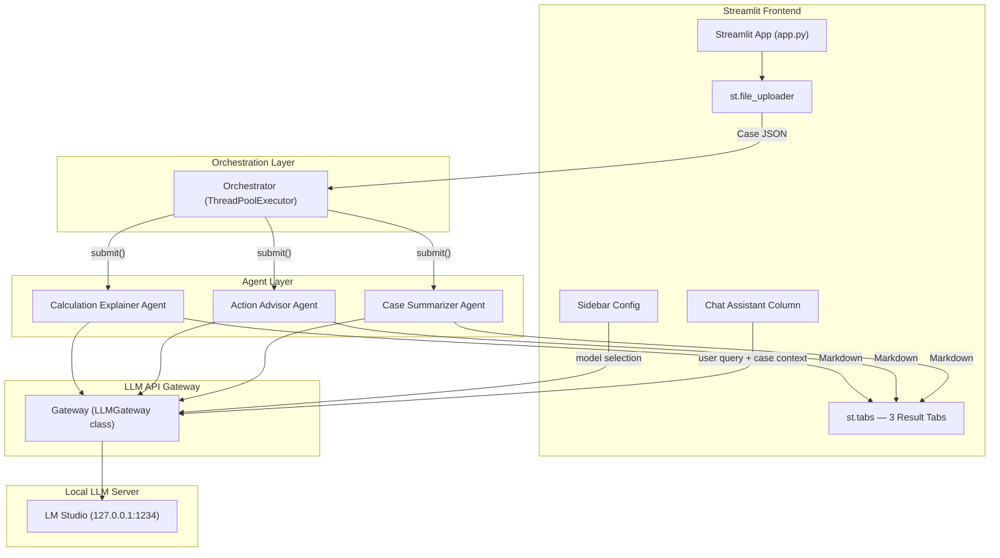
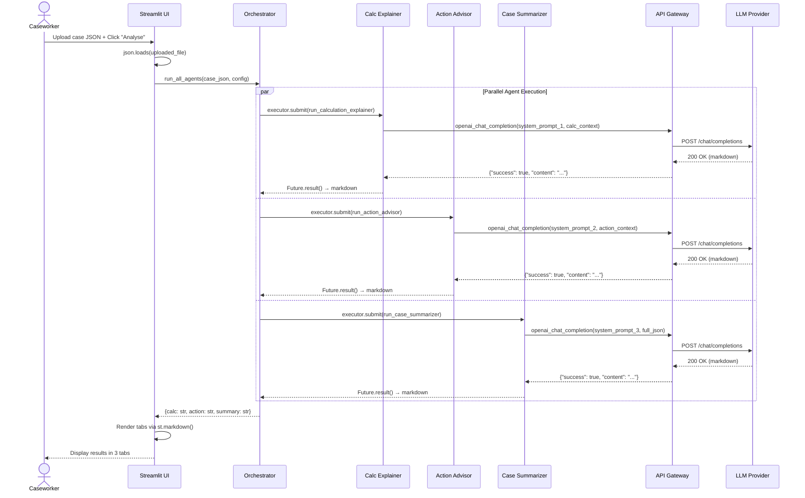
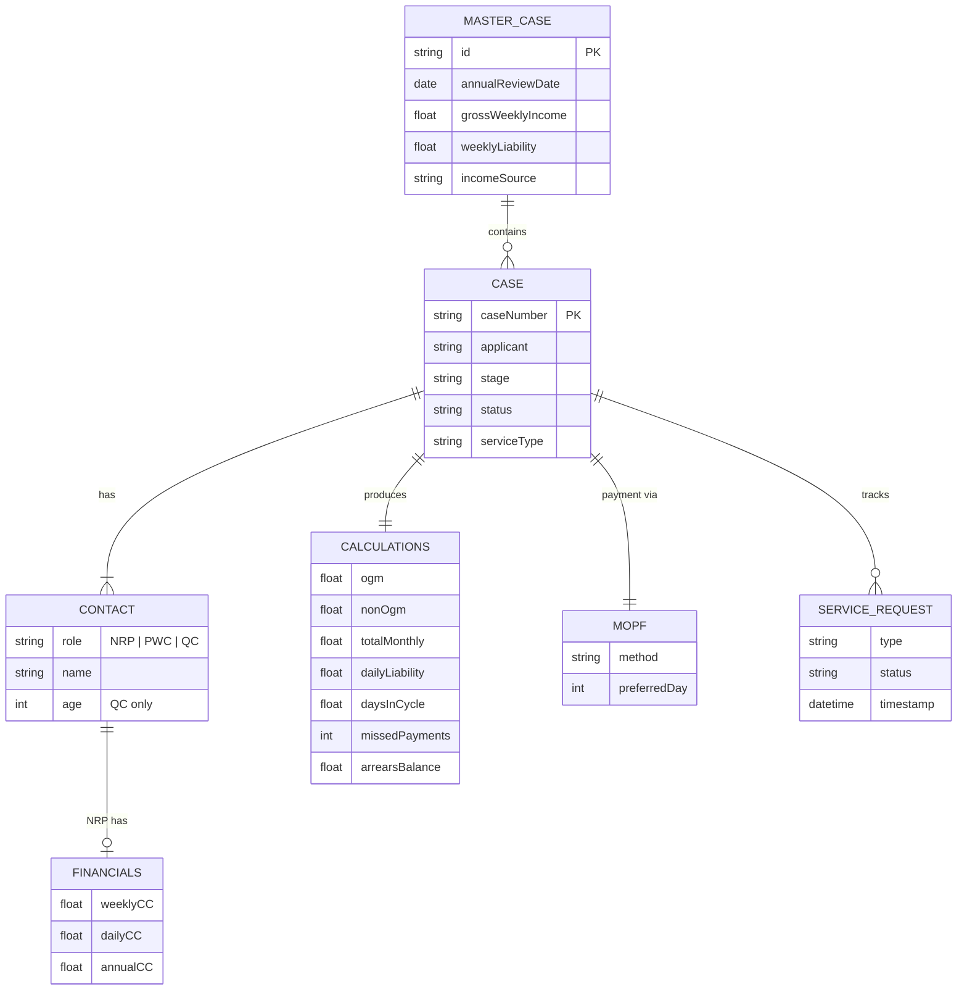
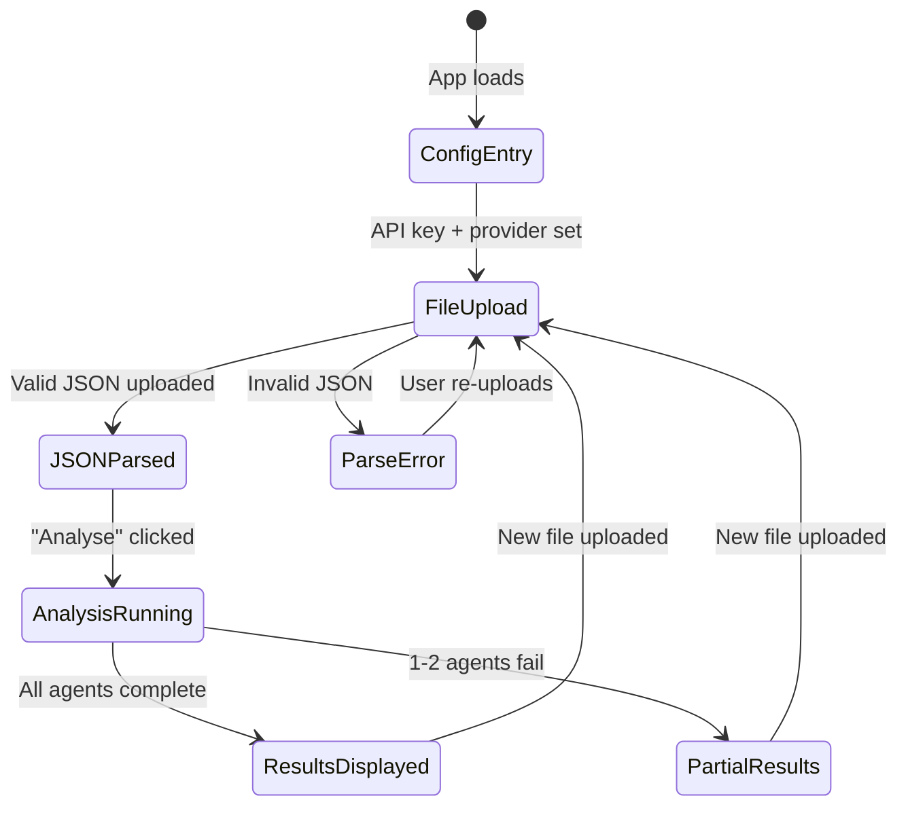
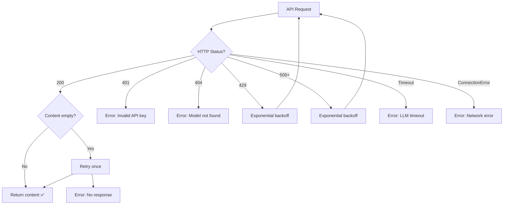
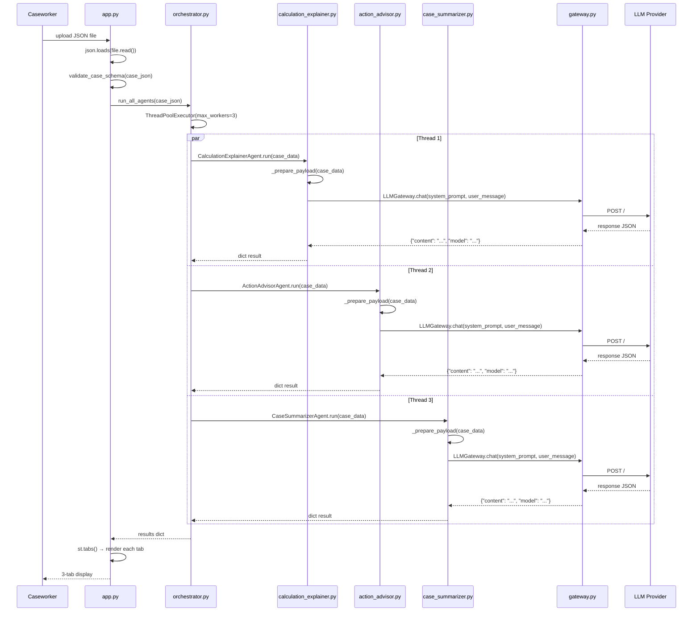

# Low-Level Design (LLD) — AI Copilot for Caseworkers

| Field             | Value                                       |
|-------------------|---------------------------------------------|
| **Project**       | AI Copilot for Caseworkers (POC)            |
| **Version**       | 1.0                                         |
| **Date**          | 2026-06-19                                  |
| **Stack**         | Python 3.11 · Streamlit · OpenAI SDK        |
| **Architecture**  | Multi-Agent (3 agents, parallel execution)  |

---

## 1. System Architecture Overview



---

## 2. LLM API Gateway — Detailed Specification

### 2.1 Gateway Class Overview

The `LLMGateway` class provides a unified interface to interact with an OpenAI-compatible local LLM endpoint (defaulting to `meta-llama-3-8b-instruct`).

```python
class LLMGateway:
    def __init__(
        self,
        api_key: str,
        api_url: str,
        model: str = "meta-llama-3-8b-instruct",
        max_retries: int = 3,
        timeout: int = 900,
    ):
        ...
```

### 2.2 Unified Request Schema

The custom API expects a standard OpenAI Chat Completions JSON payload containing a `messages` array combining the system prompt, few-shot examples, and the user's message.

```json
{
  "model": "meta-llama-3-8b-instruct",
  "messages": [
    {"role": "system", "content": "<system_prompt>"},
    {"role": "user", "content": "<few_shot_user>"},
    {"role": "assistant", "content": "<few_shot_assistant>"},
    {"role": "user", "content": "<serialised_case_json>"}
  ],
  "temperature": 0.3,
  "stream": false
}
```

### 2.3 `chat` Method Signature

```python
def chat(
    self,
    system_prompt: str,
    user_message: str,
    few_shot_examples: list[dict] | None = None,
    model: str | None = None,
) -> dict:
    """
    Returns:
        {
            "content": str,          # Markdown response from LLM
            "model":   str,          # Model name used
            "usage":   dict,         # Token usage details
            "provider": "openai_compatible"
        }
    Raises:
        LLMGatewayError: If the API call fails after retries.
    """
```

### 2.4 Request Construction — Internal Flow

```python
import requests

headers = {
    "Content-Type": "application/json",
    "Authorization": f"Bearer {self.api_key}",
    "Connection": "close",
}

messages = [{"role": "system", "content": system_prompt}]
# ... add few_shot_examples ...
messages.append({"role": "user", "content": user_message})

payload = {
    "model": model if model else self.model,
    "messages": messages,
    "temperature": 0.3,
    "stream": False,
}

response = requests.post(
    self.api_url,
    headers=headers,
    json=payload,
    timeout=self.timeout
)
```

### 2.5 Response & Error Handling

```json
// Success (HTTP 200)
{
  "id": "chatcmpl-123",
  "model": "meta-llama-3-8b-instruct",
  "choices": [
    {
      "message": {
        "role": "assistant",
        "content": "### 🔍 Calculation Breakdown..."
      }
    }
  ],
  "usage": { "prompt_tokens": 50, "completion_tokens": 100, "total_tokens": 150 }
}
```

The gateway handles errors by parsing specific HTTP status codes, implementing exponential backoff for rate limits (`429`) and server errors (`500+`), and throwing custom `LLMGatewayError` exceptions for authentication failures (`401`, `403`) or unrecoverable issues.
```

---

## 3. Agent Specifications

### 3.1 Calculation Explainer Agent

| Attribute         | Value                                                         |
|-------------------|---------------------------------------------------------------|
| **Function**      | `run_calculation_explainer(case_json: dict) -> str`          |
| **Input**         | Full case JSON filtered to `calculations`, `contacts`, `mopf` |
| **LLM Temp**      | `0.3` (low creativity, high fidelity)                        |
| **Max Tokens**    | `2000`                                                        |
| **Output**        | Structured Markdown explanation (see §3.1.2)                 |

#### 3.1.1 System Prompt (Full)

```text
You are an expert caseworker audit assistant for the Child Maintenance Service.
Your job is to translate raw financial calculation payloads into highly clear,
professional, plain-English summaries.

STRICT RULES:
1. Use ONLY the exact currency values and figures provided in the payload.
   Do NOT perform independent arithmetic or recalculate any values.
2. **Bold** all key metrics, acronyms (OGM, NRP, PWC, QC), and financial totals
   to ensure scannability.
3. If arrears or missed payments are detected, explicitly point them out as the
   variance factor increasing the total schedule amount.
4. Always structure output using the template below.

OUTPUT TEMPLATE:
### 🔍 Calculation Breakdown

**Current Schedule:** **£{total_monthly}** for this billing cycle.
* **Ongoing Maintenance (OGM):** **£{ogm}**
    *Based on the NRP's daily liability of £{dailyLiability} across the
    standard cycle of {daysInCycle} days.*
* **Adjustments & Arrears:** **+£{nonOgm}** (Non-OGM)
    *The system detected **{missedPayments} missed payment(s)** carried over
    from the previous cycle.*

---

💡 **Note for Citizen Communication:** ...

--- FEW-SHOT EXAMPLES ---

EXAMPLE 1 — Simple OGM (No Arrears):
Input:
{
  "calculations": {"ogm": 456.25, "nonOgm": 0.00, "totalMonthly": 456.25,
   "dailyLiability": 15.00, "daysInCycle": 30.41,
   "missedPayments": 0, "arrearsBalance": 0.00}
}

Output:
### 🔍 Calculation Breakdown

**Current Schedule:** **£456.25** for this billing cycle.
* **Ongoing Maintenance (OGM):** **£456.25**
    *Based on the NRP's daily liability of £15.00 across the standard
    cycle of 30.41 days.*
* **Adjustments & Arrears:** None. No missed payments detected.

---
💡 **Note for Citizen Communication:** You can inform the client that their
regular ongoing amount is £456.25 with no outstanding balances.


EXAMPLE 2 — OGM with Arrears:
Input:
{
  "calculations": {"ogm": 456.25, "nonOgm": 456.25, "totalMonthly": 912.50,
   "dailyLiability": 15.00, "daysInCycle": 30.41,
   "missedPayments": 1, "arrearsBalance": 456.25}
}

Output:
### 🔍 Calculation Breakdown

**Current Schedule:** **£912.50** for this billing cycle.
* **Ongoing Maintenance (OGM):** **£456.25**
    *Based on the NRP's daily liability of £15.00 across the standard
    cycle of 30.41 days.*
* **Adjustments & Arrears:** **+£456.25** (Non-OGM)
    *The system detected **1 missed payment** carried over from the
    previous cycle, resulting in an outstanding **arrears balance of £456.25**.*

---
💡 **Note for Citizen Communication:** You can inform the client that their
regular ongoing amount remains £456.25, but this month's draft is doubled
to clear the outstanding balance from last month.
```

#### 3.1.2 Data Extraction (Pre-processing)

```python
def _prepare_payload(self, case_data: dict) -> str:
    """Extract and structure the calculation-relevant data from the case JSON."""
    payload_parts = []
    # Implementation extracts calculation specific context
    # ...
```

---

### 3.2 Action Advisor Agent

| Attribute         | Value                                                              |
|-------------------|--------------------------------------------------------------------|
| **Function**      | `run_action_advisor(case_json: dict) -> str`                      |
| **Input**         | Case JSON filtered to arrears, contact details, financial history |
| **LLM Temp**      | `0.3`                                                              |
| **Max Tokens**    | `2000`                                                             |
| **Output**        | Risk classification (Low / Medium / High) + action items           |

#### 3.2.1 System Prompt (Full)

```text
You are a senior enforcement strategy advisor for the Child Maintenance Service.
Analyse the provided case data and produce an enforcement risk assessment with
actionable recommendations for the caseworker.

RULES:
1. Classify enforcement risk as one of: 🟢 Low / 🟡 Medium / 🔴 High.
2. Use ONLY figures from the payload. Do NOT invent data.
3. Base risk classification on:
   - Arrears balance relative to monthly liability
   - Number of missed payments
   - Case status and stage
4. For Medium/High risk, suggest negotiation amounts based on the NRP's
   gross weekly income and current arrears balance.
5. Structure output as shown below.

RISK CLASSIFICATION LOGIC:
- LOW:    arrearsBalance == 0 OR missedPayments == 0
- MEDIUM: arrearsBalance > 0 AND arrearsBalance <= 2 × totalMonthly
- HIGH:   arrearsBalance > 2 × totalMonthly OR missedPayments >= 3

OUTPUT TEMPLATE:
### ⚖️ Enforcement Risk Assessment

**Risk Level:** 🟡 **Medium**

**Key Indicators:**
| Metric              | Value     |
|---------------------|-----------|
| Arrears Balance     | £{x}     |
| Missed Payments     | {n}      |
| Monthly Liability   | £{y}     |
| Gross Weekly Income | £{z}     |

**Recommended Actions:**
1. **Contact NRP** ({name}) to discuss repayment options.
2. **Suggested negotiation:** £{amount}/month over {n} months
   (based on {percentage}% of gross weekly income).
3. **Review case history** for prior enforcement actions.
4. **Escalation:** {if HIGH: "Refer to enforcement team immediately."}
```

#### 3.2.2 Data Extraction

```python
def _prepare_payload(self, case_data: dict) -> str:
    """Extract and structure the action-relevant data from the case JSON."""
    payload_parts = []
    # Implementation extracts action specific context
    # ...
```

---

### 3.3 Case Summarizer Agent

| Attribute         | Value                                                  |
|-------------------|--------------------------------------------------------|
| **Function**      | `CaseSummarizerAgent.run(case_data: dict) -> dict`     |
| **Input**         | Full case JSON (no filtering)                         |
| **LLM Temp**      | `0.3`                                                  |
| **Max Tokens**    | `2000`                                                 |
| **Output**        | Concise overview with key metrics, contacts, statuses |

#### 3.3.1 System Prompt (Full)

```text
You are a case briefing assistant for the Child Maintenance Service.
Produce a concise, scannable summary of the provided case data so a
caseworker can quickly understand the case state before taking a call.

RULES:
1. Use ONLY data from the payload. Do NOT invent or assume any details.
2. Keep the summary under 250 words.
3. Bold all names, case numbers, and financial amounts.
4. Always include: case ID, all contacts (NRP, PWC, QC), key financials,
   case stage/status, service type, and latest service request status.

OUTPUT TEMPLATE:
### 📋 Case Summary — {caseNumber}

**Master Case:** {masterCaseId} | **Annual Review:** {annualReviewDate}

**Contacts:**
| Role | Name       | Key Detail           |
|------|------------|----------------------|
| NRP  | {name}     | Income: £{x}/week   |
| PWC  | {name}     | Applicant            |
| QC   | {name}     | Age: {age}           |

**Financial Snapshot:**
- Gross Weekly Income: **£{x}**
- Weekly Liability: **£{y}**
- Current OGM: **£{ogm}**/month
- Arrears Balance: **£{arrears}**

**Case Status:** {stage} — {status}
**Service Type:** {serviceType}
**Payment Method:** {mopf.method} (Preferred day: {mopf.preferredDay})
**Latest SR:** {srType} — {srStatus}
```

---

## 4. Orchestrator — Parallel Execution Engine

### 4.1 Sequence Diagram



### 4.2 Orchestrator Implementation

```python
from concurrent.futures import ThreadPoolExecutor, as_completed, TimeoutError

AGENT_TIMEOUT = 30  # seconds per agent

def run_all_agents(case_json: dict, config: dict) -> dict:
    """
    Execute all 3 agents in parallel.
    Implements Promise.allSettled semantics: individual failures
    do not prevent other agents from returning results.

    Args:
        case_json: Parsed case JSON payload.
        config:    {"provider", "api_key", "model"}

    Returns:
        {
            "calculation": {"success": bool, "content": str | None, "error": str | None},
            "action":      {"success": bool, "content": str | None, "error": str | None},
            "summary":     {"success": bool, "content": str | None, "error": str | None}
        }
    """
    results = {}

    with ThreadPoolExecutor(max_workers=3) as executor:
        future_to_agent = {
            executor.submit(run_calculation_explainer, case_json, config): "calculation",
            executor.submit(run_action_advisor,        case_json, config): "action",
            executor.submit(run_case_summarizer,       case_json, config): "summary",
        }

        for future in as_completed(future_to_agent, timeout=AGENT_TIMEOUT):
            agent_name = future_to_agent[future]
            try:
                results[agent_name] = {
                    "success": True,
                    "content": future.result(timeout=AGENT_TIMEOUT),
                    "error": None
                }
            except TimeoutError:
                results[agent_name] = {
                    "success": False,
                    "content": None,
                    "error": "LLM took too long. Please retry."
                }
            except Exception as e:
                results[agent_name] = {
                    "success": False,
                    "content": None,
                    "error": str(e)
                }

    return results
```

### 4.3 Execution Characteristics

| Property                  | Value                                                    |
|---------------------------|----------------------------------------------------------|
| Concurrency model         | `ThreadPoolExecutor` (I/O-bound, GIL-safe for HTTP)     |
| `max_workers`             | `3` (one per agent)                                      |
| Dispatch method           | `executor.submit()` — non-blocking                      |
| Collection method         | `as_completed()` — yields results as they finish         |
| Failure isolation         | `Promise.allSettled` equivalent — each agent independent |
| Timeout                   | 30 s per agent via `future.result(timeout=30)`           |
| Thread safety             | Each agent gets its own HTTP client; no shared state     |

---

## 5. Demo Data Schema

### 5.1 Full JSON Structure

```json
{
  "masterCase": {
    "id": "1-ABC123X",
    "annualReviewDate": "2026-06-15",
    "previousAnnualReviewDate": "2025-06-15",
    "grossWeeklyIncome": 1500.00,
    "assessedWeeklyIncome": 1250.50,
    "incomeSource": "Employment",
    "liabilityAmount": 200.00,
    "weeklyLiability": 50.00,
    "activeCasesCount": 1,
    "cases": [
      {
        "caseNumber": "CASE-001",
        "applicant": "Jane Doe",
        "stage": "Active",
        "status": "Open",
        "subStatus": null,
        "serviceType": "Calc and Collect",
        "contacts": [
          {
            "role": "NRP",
            "name": "John Smith",
            "financials": {
              "weeklyCC": 45.00,
              "dailyCC": 6.43,
              "annualCC": 3900.00
            }
          },
          {
            "role": "PWC",
            "name": "Jane Doe"
          },
          {
            "role": "QC",
            "name": "Alex Smith",
            "age": 12
          }
        ],
        "calculations": {
          "ogm": 456.25,
          "nonOgm": 456.25,
          "totalMonthly": 912.50,
          "dailyLiability": 15.00,
          "daysInCycle": 30.41,
          "missedPayments": 1,
          "arrearsBalance": 456.25
        },
        "mopf": {
          "method": "Direct Debit",
          "preferredDay": 15
        },
        "serviceRequests": [
          {
            "type": "Perform Calculation",
            "status": "Completed",
            "timestamp": "2026-06-10T14:30:00Z"
          }
        ]
      }
    ]
  }
}
```

### 5.2 Entity Relationship Diagram



---

## 6. Streamlit UI Components — Detailed Breakdown

### 6.1 Component Tree

```
app.py
├── st.sidebar
│   ├── st.text_input("Case Summarizer Model", value=LLM_MODEL)
│   ├── st.text_input("Calculation Explainer Model", value=LLM_MODEL)
│   └── st.text_input("Action Advisor Model", value=LLM_MODEL)
├── st.title("🤖 AI Copilot for Caseworkers")
├── chat_col
│   ├── st.container(height=550)    → displays chat history
│   └── st.chat_input("Ask...")     → sends message to Gateway
├── main_col
│   ├── st.file_uploader("Upload Case JSON", type=["json"])
│   ├── st.button("🔍 Analyse Case")
│   │   └── st.spinner("Agents are analysing the case...")
│   │       └── run_all_agents(case_json, config)
│   └── st.tabs(["📋 Summary", "🔍 Calculations", "⚖️ Actions"])
│       ├── Tab 1 → st.markdown(results["summary"])
│       ├── Tab 2 → st.markdown(results["calculation"])
│       └── Tab 3 → st.markdown(results["action"])
```

### 6.2 State Management

```python
# Streamlit session state keys
if "results" not in st.session_state:
    st.session_state.results = None       # Cached agent results
if "case_json" not in st.session_state:
    st.session_state.case_json = None     # Parsed uploaded JSON
if "analysis_done" not in st.session_state:
    st.session_state.analysis_done = False
```

### 6.3 UI Interaction Flow



---

## 7. Error Handling Matrix

### 7.1 Error Classification and Recovery

| # | Error Type          | HTTP Code | Detection Mechanism       | User-Facing Message                       | Recovery Strategy                     |
|---|---------------------|-----------|---------------------------|-------------------------------------------|---------------------------------------|
| 1 | Invalid API key     | `401`     | `response.status_code`    | "❌ Invalid API key. Check sidebar."      | Prompt user to re-enter key           |
| 2 | Rate limit exceeded | `429`     | `response.status_code`    | "⏳ Rate limited. Please wait and retry." | Auto-retry with exponential backoff   |
| 3 | Network error       | —         | `ConnectionError` raised  | "🌐 Cannot reach LLM service."           | Display retry button                  |
| 4 | Invalid JSON upload | —         | `json.JSONDecodeError`    | "📄 Invalid case data format."            | Show expected format example link     |
| 5 | LLM timeout         | —         | `TimeoutError` after 30s  | "⏱️ LLM took too long. Please retry."    | Display retry button                  |
| 6 | Empty LLM response  | `200`     | `len(content.strip())==0` | "🔇 No response from agent."             | Auto-retry once, then show retry btn  |
| 7 | Model not found     | `404`     | `response.status_code`    | "🔎 Model not found. Check model name."  | Prompt user to verify model in sidebar|
| 8 | Server error        | `500+`    | `response.status_code`    | "⚠️ LLM service error. Try again later." | Retry with exponential backoff        |

### 7.2 Retry & Backoff Strategy

```python
import time

MAX_RETRIES = 3
BACKOFF_BASE = 1.0  # seconds

def call_with_retry(fn, *args, **kwargs):
    for attempt in range(MAX_RETRIES):
        result = fn(*args, **kwargs)
        if result["success"]:
            return result
        if result.get("retryable", False):
            wait = BACKOFF_BASE * (2 ** attempt)  # 1s, 2s, 4s
            time.sleep(wait)
            continue
        return result  # Non-retryable error
    return result  # Exhausted retries
```

### 7.3 Error Handling Flow



---

## 8. Configuration & Environment

### 8.1 Runtime Configuration

| Parameter         | Source                  | Default            | Constraints                  |
|-------------------|-------------------------|--------------------|------------------------------|
| `LLM_API_KEY`     | Hardcoded (`app.py`)    | `"lm-studio"`      | Non-empty string             |
| `LLM_API_URL`     | Hardcoded (`app.py`)    | local endpoint     | Valid URL                    |
| `model_summarizer`| Sidebar text input      | `"meta-llama-3-8b-instruct"` | Non-empty string |
| `model_explainer` | Sidebar text input      | `"meta-llama-3-8b-instruct"` | Non-empty string |
| `model_advisor`   | Sidebar text input      | `"meta-llama-3-8b-instruct"` | Non-empty string |
| `temperature`     | Hardcoded (`gateway.py`)| `0.3`              | `0.0 ≤ t ≤ 2.0`             |
| `agent_timeout`   | Hardcoded constant      | `900` (seconds)    | Positive integer             |
| `max_workers`     | Hardcoded constant      | `3`                | Matches number of agents     |
| `max_retries`     | Hardcoded constant      | `3`                | Positive integer             |

### 8.2 Dependencies

```
streamlit>=1.30.0
httpx>=0.25.0        # HTTP client with timeout support
openai>=1.0.0        # Optional: for SDK-based calls
```

---

## 9. File & Module Structure

```
AI_Copilot_CW/
├── app.py                  # Streamlit entry point, UI layout, tab rendering
├── agents/
│   ├── __init__.py
│   ├── calculation_explainer.py  # Calc Explainer agent
│   ├── action_advisor.py         # Action Advisor agent
│   ├── case_summarizer.py        # Case Summarizer agent
│   └── orchestrator.py           # run_all_agents(), ThreadPoolExecutor logic
├── llm/
│   ├── __init__.py
│   └── gateway.py                # LLMGateway API client class
├── prompts/
│   ├── __init__.py
│   └── system_prompts.py         # Centralized prompts and few-shot examples
├── data/
│   └── sample_case.json         # Demo JSON payload
├── docs/
│   ├── HLD.md
│   └── LLD.md                   # ← This document
├── requirements.txt
└── README.md
```

---

## 10. Data Flow — Function-Level Trace



---

## 11. Security Considerations

| Concern                   | Mitigation                                                          |
|---------------------------|---------------------------------------------------------------------|
| API key exposure          | `st.text_input(type="password")` — masked in UI, never logged      |
| Key in session state      | Stored only in `st.session_state`; cleared on browser close         |
| Prompt injection          | System prompts are hardcoded; user input is data-only (JSON)       |
| Data in transit           | All LLM API calls over HTTPS/TLS                                   |
| PII in case data          | POC uses synthetic demo data; production requires PII redaction    |
| LLM response validation   | Output rendered as Markdown only; `unsafe_allow_html` limited use  |

---

## 12. Performance Targets (POC)

| Metric                           | Target           | Notes                                    |
|----------------------------------|------------------|------------------------------------------|
| End-to-end latency (3 agents)   | ≤ 10 seconds     | Parallel execution; bottleneck = slowest |
| Individual agent latency         | ≤ 5 seconds      | Typical for GPT-4o with 2K max tokens   |
| Max concurrent users (POC)       | 1                | Single Streamlit instance                |
| Input payload size limit          | ≤ 50 KB          | Sufficient for multi-case JSON           |
| LLM token budget per request     | ~3,000 total     | ~1K prompt + ~2K completion              |

---

*End of Low-Level Design Document*
